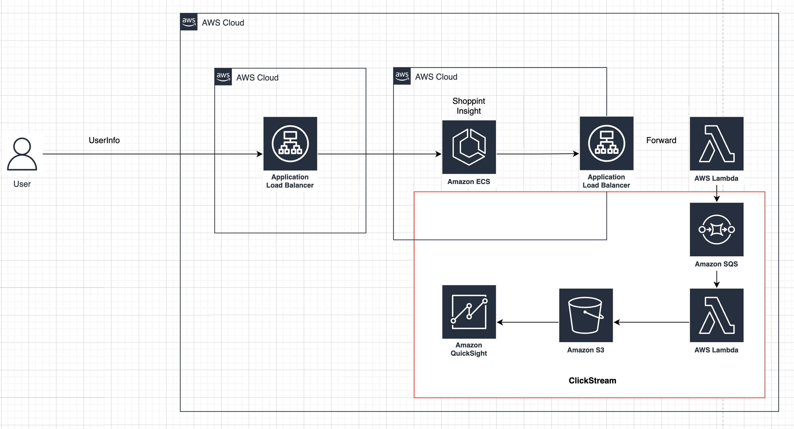

# ClickStream made with Terraform



## 구성 방법

```sh
    ## docker push
    make upload-fe

    ## Infra Settings
    make setting

```

## ClickStream

... 

## Reference 

- <a href="https://registry.terraform.io/modules/zkfmapf123/vpc3tier/lee/latest"> terraform vpc3tier module </a>
- <a href="https://registry.terraform.io/modules/zkfmapf123/ecs-fargate/lee/latest"> terraform ecs module </a>
- <a href="https://aws.amazon.com/ko/blogs/korea/new-solution-clickstream-analytics-on-aws-for-mobile-and-web-applications/"> ClickStream  Documents </a>