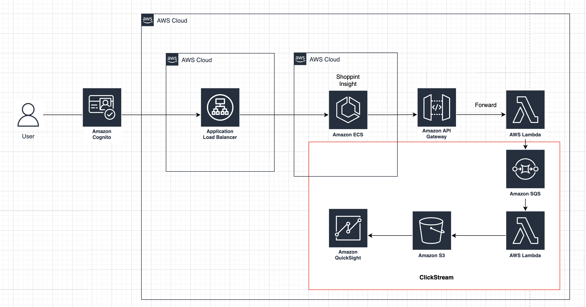

# ClickStream made with Terraform



## Todo

- [x] Front ECS
- [x] Lambda Functions
- [x] Connect Lambda ALB
- [x] SQS
- [x] SQS SendMessage
- [ ] SQS PollingMessage
- [ ] Ingest S3
- [ ] Module

## 구성 방법

```sh
    ## front build && docker push
    make upload-fe

    ## lambda build 
    make lambda-build

    ## Infra Settings
    make setting

```

## ClickStream

- Lambda -> s3 Ingestion 시, Put 비용이슈를 줄이기 위해 Queue를 Batch성으로 Put
- SQS -> Kinesis DataStream으로 진행해도 좋을듯

## Frontend Unique Id

### 브라우저내의 진입한 유저 Unique ID 설정

```ts
// index.js

import React from "react";
import ReactDOM from "react-dom/client";
import { Provider as RTKProvider } from "react-redux";
import App from "./App";
import GlobalStyle from "./styles/globalStyles";
import store from "./redux/store/store";
import { v4 as uuid4 } from "uuid";

// added
const generateAndSaveUniqueId = () => {
  const uniqId = uuid4();
  sessionStorage.setItem("userId", uniqId);
};

// added
if (!sessionStorage.getItem("userId")) {
  generateAndSaveUniqueId();
}

const root = ReactDOM.createRoot(
  document.getElementById("root") as HTMLElement
);
root.render(
  <RTKProvider store={store}>
    <GlobalStyle />
    <App />
  </RTKProvider>
);
```

### Event 기반 함수호출

```ts
import axios from "axios";
import dayjs from 'dayjs'

interface Props {
  clickEvent: string;
  userId: string;
  userAgent: string;
  platform: string;
  language: string;
}

export const useClickEvent = async (props: Props) => {
  try {
    const res = await axios.post(REACT_ALB_URL, {
      headers : {
        "Content-Type" : "application/json"
      },
      body: {
        clickEvent: props.clickEvent,
        userId: props.userId,
        userAgent: props.userAgent,
        platform: props.platform,
        language: props.language,
        eventCreatedAt: dayjs().unix()
      }
    });

    console.log("Response:", res.data);
  } catch (error) {

    console.error("Error:", error);
  }
};
```


## Reference 

- <a href="https://registry.terraform.io/modules/zkfmapf123/vpc3tier/lee/latest"> terraform vpc3tier module </a>
- <a href="https://registry.terraform.io/modules/zkfmapf123/ecs-fargate/lee/latest"> terraform ecs module </a>
- <a href="https://aws.amazon.com/ko/blogs/korea/new-solution-clickstream-analytics-on-aws-for-mobile-and-web-applications/"> ClickStream  Documents </a>